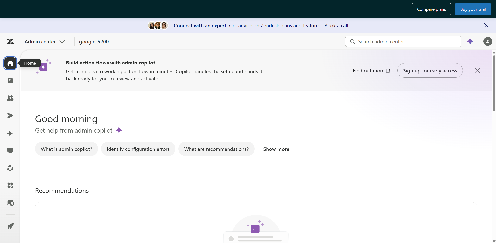
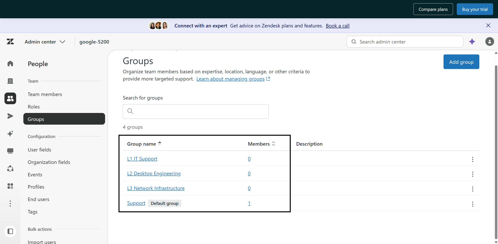
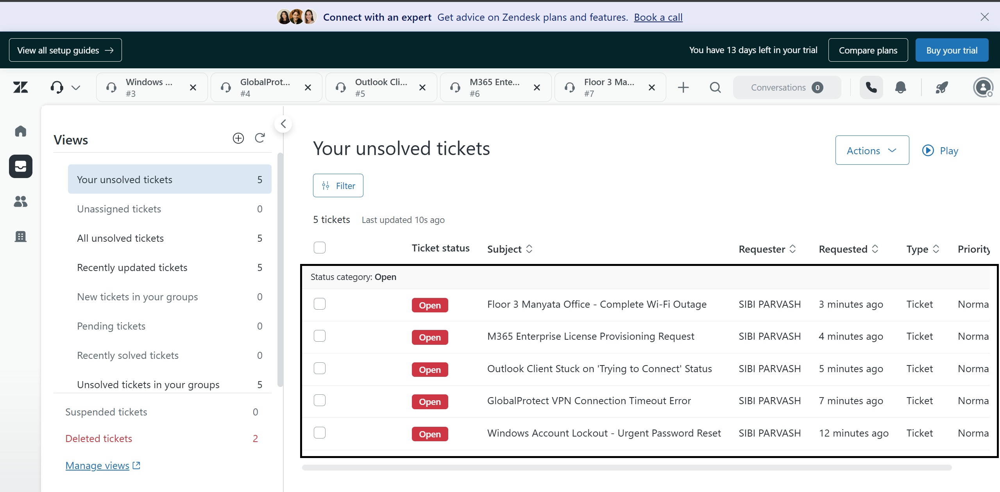
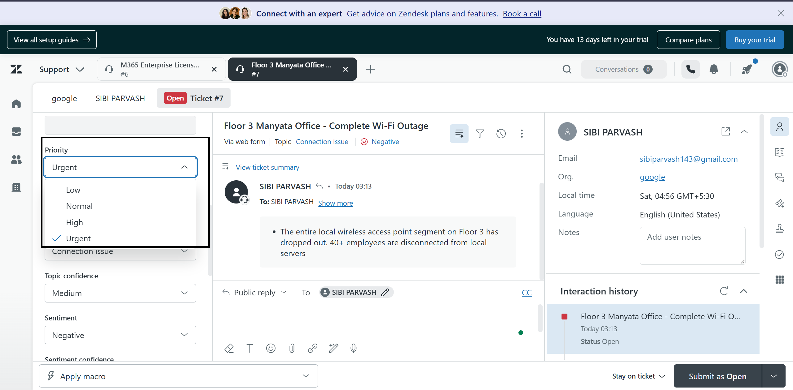
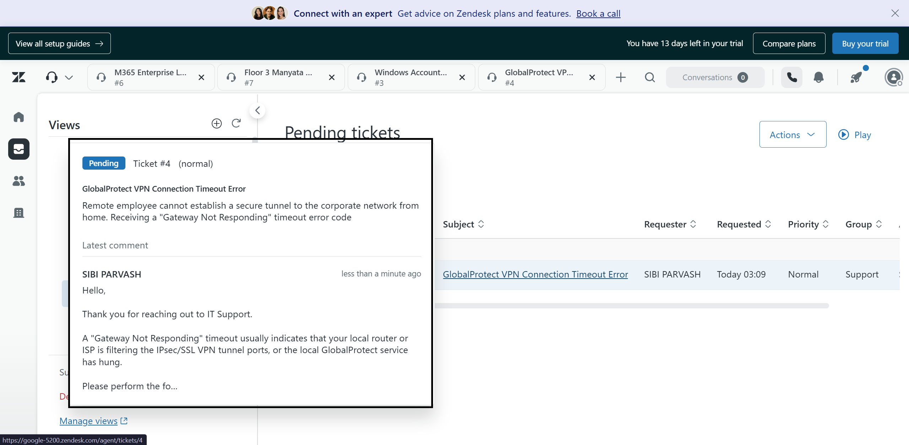
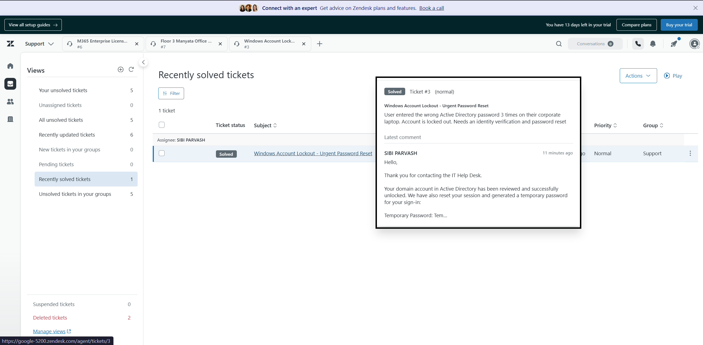

# Enterprise-Ticketing-System-Lab

### 1. Admin Center Environment Setup



* **Objective:** Accessing and initializing the Zendesk Support Admin Center for instance `google-5200`.
* **Key Components:**
  * **Tenant Instance:** `google-5200.zendesk.com/admin`
  * **Navigation Hub:** Global administration entry point for configuring organization-wide business rules, routing, SLA matrices, and access permissions.
* **System Impact:** Serves as the central control plane for defining ITIL-compliant service desk workflows and platform architectures before ingesting user tickets.

---

### 2. Multi-Tier Support Group Configuration



* **Objective:** Establishing a tiered organizational support structure to segregate responsibilities between frontline help desk staff and senior engineering units.
* **Configured Groups:**
  * `Support` (Default Group, 1 Member): Default landing queue for general intake and Tier 1 triage.
  * `L1 IT Support` (0 Members): Dedicated frontline triage pool.
  * `L2 Desktop Engineering` (0 Members): Mid-tier endpoint and hardware troubleshooting queue.
  * `L3 Network Infrastructure` (0 Members): Specialized tier for core infrastructure, routing, VLAN, and major outage remediations.
* **Engineering Insight:** Setting up formal groups is a prerequisite for rule-based escalation and assignee relational integrity. Tickets cannot be escalated to specialized engineers without an isolated target group.

---

### 3. Incident Ingestion & Triage Queue Simulation



* **Objective:** Simulating real-world multi-incident ingestion to evaluate queue triage, default status assignment, and view categorization.
* **Managed Incidents Ingested:**
  * `Ticket #7`: *Floor 3 Manyata Office - Complete Wi-Fi Outage*
  * `Ticket #6`: *M365 Enterprise License Provisioning Request*
  * `Ticket #5`: *Outlook Client Stuck on 'Trying to Connect' Status*
  * `Ticket #4`: *GlobalProtect VPN Connection Timeout Error*
  * `Ticket #3`: *Windows Account Lockout - Urgent Password Reset*
* **Platform Behavior Observed:** All tickets initially defaulted to status `Open` with `Normal` priority via system default baseline rules (`Set tickets with no priority to normal`), illustrating the necessity for targeted priority classification and auto-escalation triggers.

---

### 4. P1 Incident Priority Elevation & Scope Assessment



* **Objective:** Escalating the Manyata facility wireless failure (`Ticket #7`) to Sev-1 / P1 status based on business impact.
* **Key Fields & Values:**
  * **Ticket Subject:** `Floor 3 Manyata Office - Complete Wi-Fi Outage`
  * **Impact Statement:** Complete loss of wireless connectivity on Floor 3 affecting 40+ employees, severing access to local network shares and VoIP infrastructure.
  * **Priority Field:** Manually upgraded from `Normal` to `Urgent`.
  * **AI / Sentiment Engine:** Tagged with `Negative` sentiment and `Connection issue` topic.
* **Engineering Insight:** Setting priority to `Urgent` is the prerequisite trigger for arming calendar-based P1 SLA targets (15-minute response, 2-hour resolution) defined in the corporate SLA framework.

* ---

* ---

### 5. Awaiting Requester Action (Pending State Diagnostics)

)

* **Objective:** Managing remote access troubleshooting and placing tickets into a `Pending` state while awaiting end-user network diagnostics.
* **Inspected Incident:** `Ticket #4` (*GlobalProtect VPN Connection Timeout Error*).
* **Technical Diagnostics Observed:**
  * **Symptom:** Remote employee unable to establish an IPsec/SSL VPN tunnel to the enterprise network; receiving a `Gateway Not Responding` timeout.
  * **Diagnostic Guidance Dispatched:** Provided instructions for the user to verify local router/ISP port filtering (UDP 4501/500/ESP) and restart the local GlobalProtect client service.
* **ITIL Workflow Insight:** Setting status to `Pending` transfers responsibility to the requester, pausing internal response metrics while keeping the active incident queue clean.

---

### 6. Incident Resolution & Identity Remediation Verification



* **Objective:** Performing identity verification and completing the full resolution lifecycle for access control incidents in the `Recently solved tickets` view.
* **Inspected Incident:** `Ticket #3` (*Windows Account Lockout - Urgent Password Reset*).
* **Remediation Details Observed:**
  * **Symptom:** User entered incorrect Active Directory password three times on a corporate laptop, triggering an automated domain security lockout.
  * **Resolution Action:** Verified user identity, checked Active Directory domain controller logs, unlocked the account object, terminated stale sessions, and provisioned a temporary logon password.
  * **Status:** Marked `Solved`, completing the ticket lifecycle and halting all active SLA clocks.
* **Engineering Impact:** Demonstrates ITIL-aligned identity administration and proper resolution documentation for auditing and SLA compliance.
```


