# Enterprise-Ticketing-System-Lab

Enterprise ITSM lab in Zendesk Support aligned with ITIL v4. Streamlines Tier-1 to Tier-3 workflows, automates P1 incident triage, enforces tiered SLA policies, and implements heuristic routing triggers with complete audit trail verification.

---

### 1. Admin Center Environment Setup


* **Objective:** Accessing and initializing the Zendesk Support Admin Center for instance `google-5200`.
* **Key Components:**
  * **Tenant Instance:** `google-5200.zendesk.com/admin`
  * **Navigation Hub:** Global administration entry point for configuring organization-wide business rules, routing, SLA matrices, and access permissions.
* **System Impact:** Serves as the central control plane for defining ITIL-compliant service desk workflows and platform architectures before ingesting user tickets.

---

### 2. Multi-Tier Support Group Configuration


* **Objective:** Establishing a tiered organizational support structure to segregate responsibilities between frontline help desk staff and senior engineering units.
* **Configured Groups:**
  * `Support` (Default Group, 1 Member): Default landing queue for general intake and Tier 1 triage.
  * `L1 IT Support` (0 Members): Dedicated frontline triage pool.
  * `L2 Desktop Engineering` (0 Members): Mid-tier endpoint and hardware troubleshooting queue.
  * `L3 Network Infrastructure` (0 Members): Specialized tier for core infrastructure, routing, VLAN, and major outage remediations.
* **Engineering Insight:** Setting up formal groups is a prerequisite for rule-based escalation and assignee relational integrity. Tickets cannot be escalated to specialized engineers without an isolated target group.

---

### 3. Incident Ingestion & Triage Queue Simulation


* **Objective:** Simulating real-world multi-incident ingestion to evaluate queue triage, default status assignment, and view categorization.
* **Managed Incidents Ingested:**
  * `Ticket #7`: *Floor 3 Manyata Office - Complete Wi-Fi Outage*
  * `Ticket #6`: *M365 Enterprise License Provisioning Request*
  * `Ticket #5`: *Outlook Client Stuck on 'Trying to Connect' Status*
  * `Ticket #4`: *GlobalProtect VPN Connection Timeout Error*
  * `Ticket #3`: *Windows Account Lockout - Urgent Password Reset*
* **Platform Behavior Observed:** All tickets initially defaulted to status `Open` with `Normal` priority via system default baseline rules (`Set tickets with no priority to normal`), illustrating the necessity for targeted priority classification and auto-escalation triggers.

---

### 4. P1 Incident Priority Elevation & Scope Assessment


* **Objective:** Escalating the Manyata facility wireless failure (`Ticket #7`) to Sev-1 / P1 status based on business impact.
* **Key Fields & Values:**
  * **Ticket Subject:** `Floor 3 Manyata Office - Complete Wi-Fi Outage`
  * **Impact Statement:** Complete loss of wireless connectivity on Floor 3 affecting 40+ employees, severing access to local network shares and VoIP infrastructure.
  * **Priority Field:** Manually upgraded from `Normal` to `Urgent`.
  * **AI / Sentiment Engine:** Tagged with `Negative` sentiment and `Connection issue` topic.
* **Engineering Insight:** Setting priority to `Urgent` is the prerequisite trigger for arming calendar-based P1 SLA targets (15-minute response, 2-hour resolution) defined in the corporate SLA framework.

* ---

* ---

### 5. Awaiting Requester Action (Pending State Diagnostics)

)

* **Objective:** Managing remote access troubleshooting and placing tickets into a `Pending` state while awaiting end-user network diagnostics.
* **Inspected Incident:** `Ticket #4` (*GlobalProtect VPN Connection Timeout Error*).
* **Technical Diagnostics Observed:**
  * **Symptom:** Remote employee unable to establish an IPsec/SSL VPN tunnel to the enterprise network; receiving a `Gateway Not Responding` timeout.
  * **Diagnostic Guidance Dispatched:** Provided instructions for the user to verify local router/ISP port filtering (UDP 4501/500/ESP) and restart the local GlobalProtect client service.
* **ITIL Workflow Insight:** Setting status to `Pending` transfers responsibility to the requester, pausing internal response metrics while keeping the active incident queue clean.

---

### 6. Incident Resolution & Identity Remediation Verification


* **Objective:** Performing identity verification and completing the full resolution lifecycle for access control incidents in the `Recently solved tickets` view.
* **Inspected Incident:** `Ticket #3` (*Windows Account Lockout - Urgent Password Reset*).
* **Remediation Details Observed:**
  * **Symptom:** User entered incorrect Active Directory password three times on a corporate laptop, triggering an automated domain security lockout.
  * **Resolution Action:** Verified user identity, checked Active Directory domain controller logs, unlocked the account object, terminated stale sessions, and provisioned a temporary logon password.
  * **Status:** Marked `Solved`, completing the ticket lifecycle and halting all active SLA clocks.
* **Engineering Impact:** Demonstrates ITIL-aligned identity administration and proper resolution documentation for auditing and SLA compliance.
  

### 7. ITIL Lifecycle State Segmentation (Open, Pending, Solved)

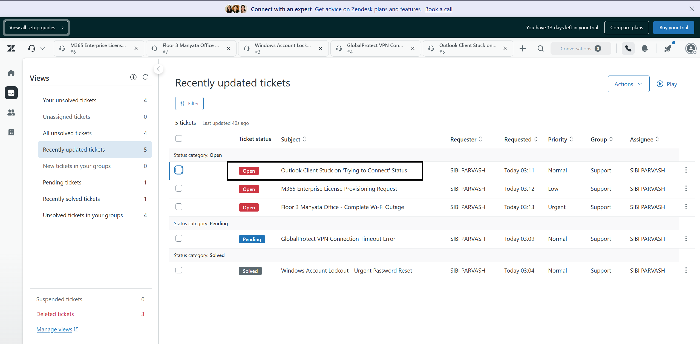

* **Objective:** Organizing ticket queues into discrete ITIL lifecycle states to maintain SLA accountability and workflow visibility.
* **Lifecycle States Managed:**
  * **Open Status:** Active tickets requiring internal troubleshooting (`Ticket #5`, `Ticket #6`, and the Sev-1 Manyata Outage `Ticket #7` set to `Urgent`).
  * **Pending Status:** `Ticket #4` (*GlobalProtect VPN Connection Timeout Error*) paused while awaiting end-user network test feedback.
  * **Solved Status:** `Ticket #3` (*Windows Account Lockout - Urgent Password Reset*) successfully fulfilled and marked resolved.
* **System Impact:** Moving tickets to `Pending` pauses requester wait timers where configured, while `Solved` seals the incident record and halts all active SLA countdowns[cite: 1].

---

### 8. Agent Workspace Dashboard & Queue Tracking

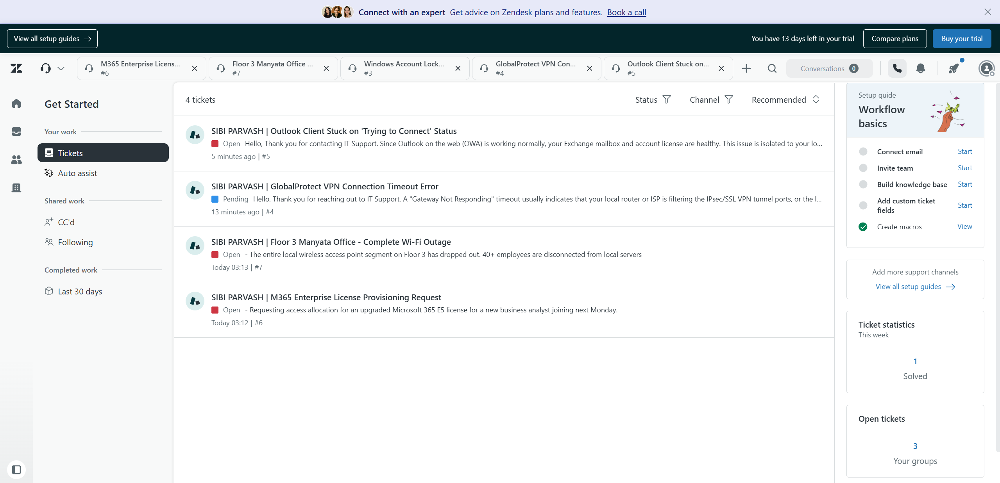

* **Objective:** Monitoring incoming ticket volume, channel sources, and resolution metrics within the unified Agent Workspace.
* **Key Components:**
  * **Unified Queue View:** Real-time visibility into open incident streams across multiple enterprise applications (Outlook, GlobalProtect VPN, Microsoft 365, and Core Wireless Infrastructure).
  * **Workload Counters:** Active tracking showing 4 open/pending incidents and 1 ticket solved for the week.
* **Operational Insight:** Agent Workspace consolidates multi-channel support requests into a streamlined single-pane-of-glass queue, preventing ticket aging and backlog drift.

---

### 9. Fast-Triage Inspection & Incident Classification

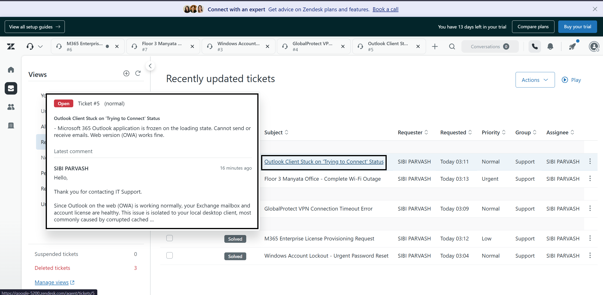

* **Objective:** Performing rapid triage using hover inspection cards directly within the ticket queue without context-switching.
* **Inspected Incident:** `Ticket #5` (*Outlook Client Stuck on 'Trying to Connect' Status*).
* **Technical Diagnostics Observed:**
  * **Symptom:** Desktop Microsoft 365 Outlook client frozen on the loading/connecting state.
  * **Root-Cause Isolation:** Web access (Outlook on the Web / OWA) verified operational, confirming Exchange mailbox and M365 licensing health; defect isolated to local desktop cached credentials or profile corruption.
* **Engineering Impact:** Enables frontline agents to quickly review diagnostic history and verify issue isolation before updating priority or routing to Tier 2.

  ---

### 10. Service Level Agreement (SLA) Policy Architecture

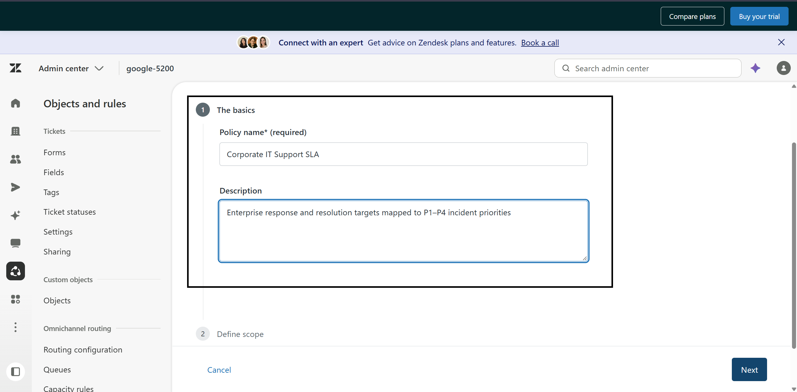

* **Objective:** Establishing an enterprise-grade Service Level Agreement framework aligned with ITIL incident management standards.
* **Policy Identity:**
  * **Policy Name:** `Corporate IT Support SLA`
  * **Description:** Enterprise response and resolution targets mapped to P1–P4 incident priorities.
* **Engineering Impact:** Provides contractual operational commitments across IT support tiers, standardizing response pacing based on severity.

---

### 11. SLA Scope & Evaluation Condition Logic

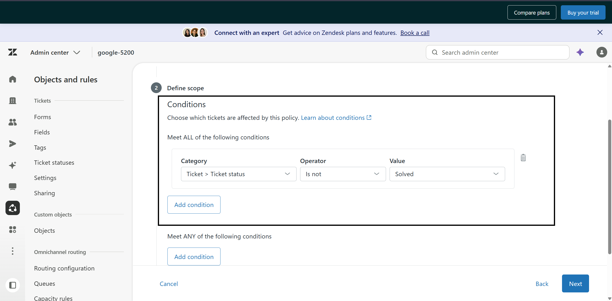

* **Objective:** Defining precise evaluation boundaries so the SLA engine monitors active tickets without persisting past resolution.
* **Evaluation Logic (Meet ALL conditions):**
  * `Ticket > Ticket status` | `Is not` | `Solved`
* **Platform Behavior:** Ensures the SLA calculation engine actively tracks all inbound, open, and pending incidents, and automatically detaches clock tracking once an incident reaches `Solved` or `Closed`.

---

### 12. Tiered Response Target Matrix Configuration

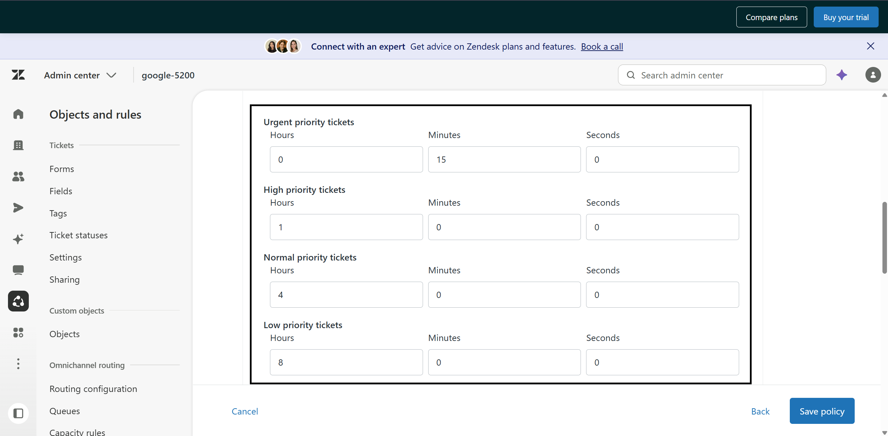

* **Objective:** Configuring deterministic response times across all four ITIL priority tiers.
* **Configured Target Values (First Reply Time):**
  * **Urgent (P1):** `0 Hours, 15 Minutes, 0 Seconds` (Calendar hours for critical business continuity).
  * **High (P2):** `1 Hour, 0 Minutes, 0 Seconds`.
  * **Normal (P3):** `4 Hours, 0 Minutes, 0 Seconds`.
  * **Low (P4):** `8 Hours, 0 Minutes, 0 Seconds`.
* **Engineering Impact:** Guarantees critical service outages (P1) receive immediate technical engagement within 15 minutes, while standard operational requests remain on sustainable business-hour timelines.

---

### 13. SLA Engine Execution & First Reply Breach Telemetry

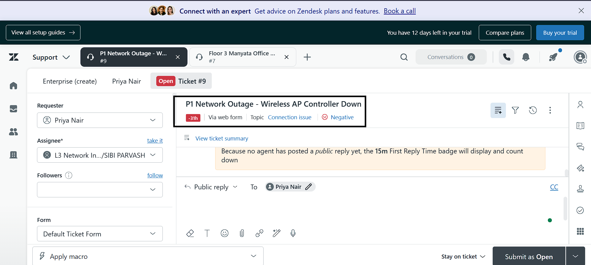

* **Objective:** Validating real-time SLA badge tracking and analyzing metric breach telemetry on an active P1 incident.
* **Inspected Incident:** `Ticket #9` (*P1 Network Outage - Wireless AP Controller Down*).
* **Telemetry Diagnostics Observed:**
  * **SLA Metric Badge:** Displays an active breach indicator (`-31h` in red).
  * **Root Cause Analysis:** The incident was created with an **Internal note** rather than a public response. Because internal notes do not communicate with the requester, Zendesk treated the ticket as awaiting an initial agent response, running the 15-minute First Reply clock continuously until it breached into negative time.
  * **Routing & Escalation:** Group assigned to `L3 Network Infrastructure` with priority set to `Urgent`.
* **ITIL Operational Insight:** Highlights the operational difference between public customer communications and internal engineering notes in metric auditing.

---

### 10. Service Level Agreement (SLA) Policy Architecture


* **Objective:** Establishing an enterprise-grade Service Level Agreement framework aligned with ITIL incident management standards.
* **Policy Identity:**
  * **Policy Name:** `Corporate IT Support SLA`
  * **Description:** Enterprise response and resolution targets mapped to P1–P4 incident priorities.
* **Engineering Impact:** Provides contractual operational commitments across IT support tiers, standardizing response pacing based on severity.

---

### 11. SLA Scope & Evaluation Condition Logic


* **Objective:** Defining precise evaluation boundaries so the SLA engine monitors active tickets without persisting past resolution.
* **Evaluation Logic (Meet ALL conditions):**
  * `Ticket > Ticket status` | `Is not` | `Solved`
* **Platform Behavior:** Ensures the SLA calculation engine actively tracks all inbound, open, and pending incidents, and automatically detaches clock tracking once an incident reaches `Solved` or `Closed`.

---

### 12. Tiered Response Target Matrix Configuration


* **Objective:** Configuring deterministic response times across all four ITIL priority tiers.
* **Configured Target Values (First Reply Time):**
  * **Urgent (P1):** `0 Hours, 15 Minutes, 0 Seconds` (Calendar hours for critical business continuity).
  * **High (P2):** `1 Hour, 0 Minutes, 0 Seconds`.
  * **Normal (P3):** `4 Hours, 0 Minutes, 0 Seconds`.
  * **Low (P4):** `8 Hours, 0 Minutes, 0 Seconds`.
* **Engineering Impact:** Guarantees critical service outages (P1) receive immediate technical engagement within 15 minutes, while standard operational requests remain on sustainable business-hour timelines.

---

### 13. SLA Engine Execution & First Reply Breach Telemetry


* **Objective:** Validating real-time SLA badge tracking and analyzing metric breach telemetry on an active P1 incident.
* **Inspected Incident:** `Ticket #9` (*P1 Network Outage - Wireless AP Controller Down*).
* **Telemetry Diagnostics Observed:**
  * **SLA Metric Badge:** Displays an active breach indicator (`-31h` in red).
  * **Root Cause Analysis:** The incident was created with an **Internal note** rather than a public response. Because internal notes do not communicate with the requester, Zendesk treated the ticket as awaiting an initial agent response, running the 15-minute First Reply clock continuously until it breached into negative time.
  * **Routing & Escalation:** Group assigned to `L3 Network Infrastructure` with priority set to `Urgent`.
* **ITIL Operational Insight:** Highlights the operational difference between public customer communications and internal engineering notes in metric auditing.

---

### 14. Auto-Escalation Trigger Definition

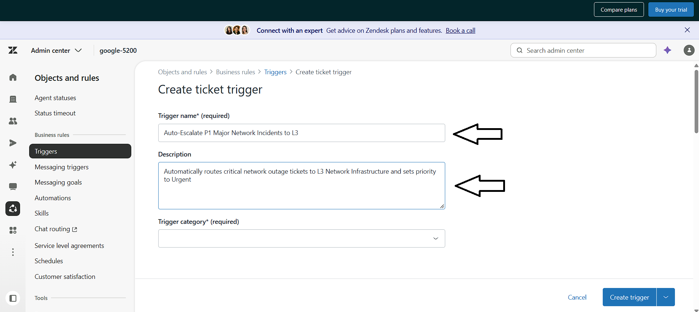

* **Objective:** Initializing an automated business rule trigger in Zendesk to eliminate manual triage delay for critical infrastructure outages.
* **Trigger Name:** `Auto-Escalate P1 Major Network Incidents to L3`
* **Trigger Description:** Automatically routes critical network outage tickets to L3 Network Infrastructure and sets priority to Urgent.
* **System Impact:** Automates Tier 1 triage by programmatically detecting outage patterns at ticket creation.

---

### 15. Lifecycle Execution Scope (Meet ALL Conditions)

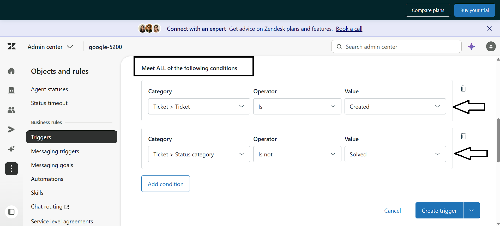

* **Objective:** Restricting trigger execution so it only evaluates tickets during initial submission.
* **Configured Conditions (Meet ALL of the following):**
  * `Ticket > Ticket` | `Is` | `Created`
  * `Ticket > Status category` | `Is not` | `Solved`
* **Engineering Insight:** Restricting the trigger to `Ticket is Created` prevents infinite update loops and avoids overriding manual tier reassignments on subsequent updates.

---

### 16. Outage Heuristic Keyword Matching (Meet ANY Conditions)

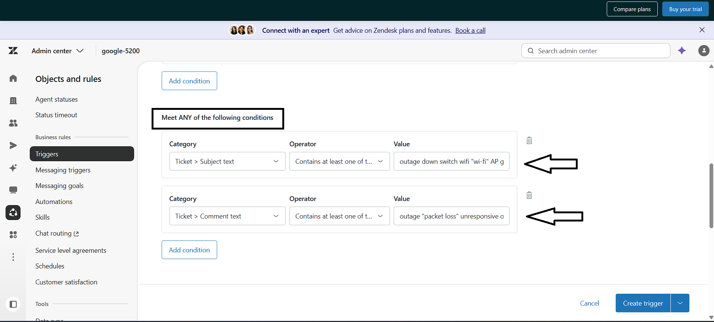

* **Objective:** Establishing a multi-keyword filter across subject lines and incoming comment bodies to detect network disruptions.
* **Configured Conditions (Meet ANY of the following):**
  * `Ticket > Subject text` | `Contains at least one of the following words` | `outage down switch wifi "wi-fi" AP gateway`
  * `Ticket > Comment text` | `Contains at least one of the following words` | `outage "packet loss" unresponsive offline "network down"`
* **Platform Behavior:** Zendesk inspects inbound ticket text strings in real time, matching exact phrases and tokenized words to identify outage reports.

---

### 17. Automated Actions & SLA Hook Configuration

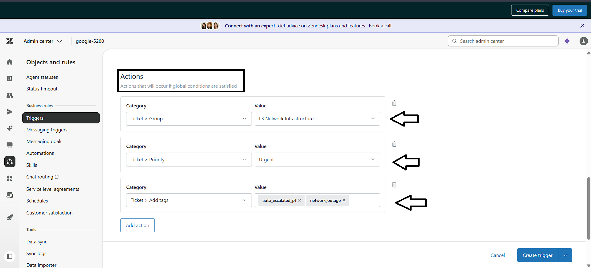

* **Objective:** Defining the automated remediation payload applied when an incoming ticket satisfies the outage criteria.
* **Configured Actions:**
  * `Ticket > Group` $\rightarrow$ `L3 Network Infrastructure`
  * `Ticket > Priority` $\rightarrow$ `Urgent`
  * `Ticket > Add tags` $\rightarrow$ `auto_escalated_p1`, `network_outage`
* **System Impact:** Automatically assigns the ticket to Tier 3, sets priority to Urgent (arming the 15-minute response / 2-hour resolution SLA targets), and tags the ticket for reporting queries.

---

### 18. End-to-End Validation: Automatic Routing to L3

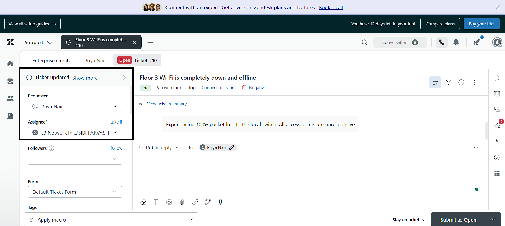

* **Objective:** Validating the automated trigger by submitting a simulated outage ticket (`Ticket #10`: *Floor 3 Wi-Fi is completely down and offline*).
* **Ingested Payload:** User reported 100% packet loss to the local switch and unresponsive access points.
* **Execution Verified:** The ticket bypassed Tier 1 triage and was immediately assigned to `L3 Network Infrastructure`.

---

### 19. End-to-End Validation: Priority Elevation & Telemetry Tags

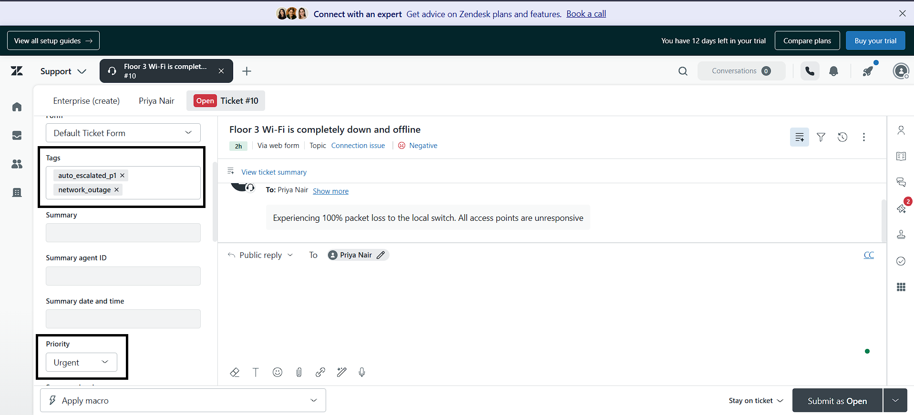

* **Objective:** Verifying that priority elevation, tags, and SLA attachments applied correctly.
* **System Results Verified:**
  * **Priority:** Elevated to `Urgent` automatically.
  * **Tags:** Appended `auto_escalated_p1` and `network_outage`.
  * **SLA Attached:** The `2h` Full Resolution SLA badge immediately attached upon creation based on the Urgent priority.

---

### 20. Microsecond Audit Trail Forensics

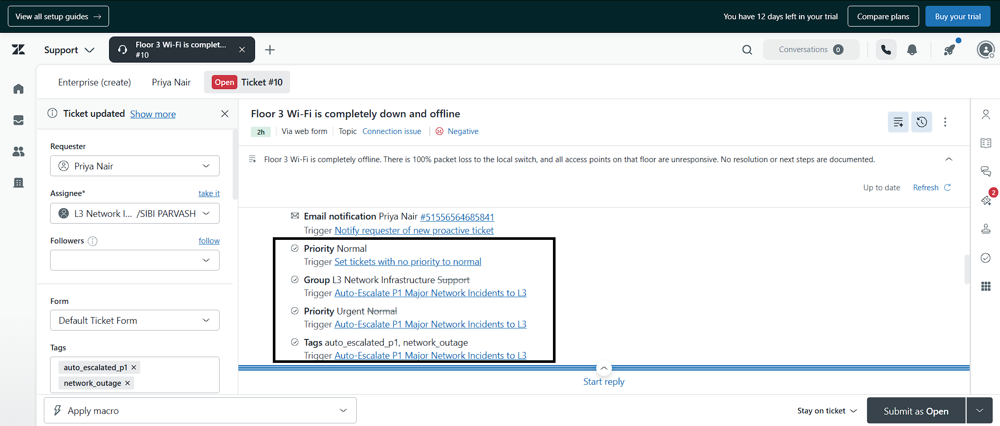

* **Objective:** Inspecting the Zendesk event timeline to verify the microsecond execution order of business rules.
* **Audit Execution Sequence Observed:**
  1. **Baseline Ingestion:** Default rule `Set tickets with no priority to normal` initially applied `Normal` priority.
  2. **Rule Interception:** Trigger `Auto-Escalate P1 Major Network Incidents to L3` fired immediately upon creation.
  3. **Queue Reassignment:** Group updated from `Support` to `L3 Network Infrastructure`.
  4. **Priority Promotion:** Priority promoted from `Normal` to `Urgent`.
  5. **Tag Ledger:** Appended `auto_escalated_p1` and `network_outage`.
* **Engineering Impact:** Provides concrete verification that the automated routing engine and SLA policies executed as designed.
```


  


